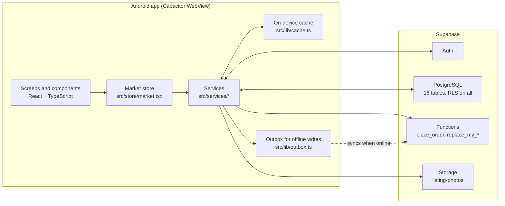

# AniSense

**Ani mo, alam mo.** A mobile app that gives farmers in Nueva Ecija, Philippines, current crop prices and price forecasts, a direct marketplace, expense and profit tracking, and weather for fieldwork, and lets buyers anywhere in the country buy straight from those farmers.


## Table of contents

- [Overview](#overview)
- [Features](#features)
- [Project status](#project-status)
- [Tech stack](#tech-stack)
- [Architecture](#architecture)
- [Getting started](#getting-started)
- [Project structure](#project-structure)
- [Further reading](#further-reading)
- [License](#license)

## Overview

Farmers often sell without knowing the market price, and buyers rarely reach farmers directly. AniSense puts both on one app:

- **Farmers** see the latest prices for their crops, post harvests for sale, record expenses and sales, and check the weather before fieldwork.
- **Buyers** browse fresh harvests, compare them against market prices, and order directly from the farmer who grew them.

The app is designed for users aged 50 to 70 on budget Android phones: text is 16px or larger, every control is at least 52px tall, the interface is available in English and Tagalog, and the core screens keep working without a signal.

The study behind the app focuses on four crops: rice, onion, garlic and calamansi. These are the crops with real price records and forecasts.

## Features

### For farmers

| Feature | Description |
|---|---|
| Prices | Monthly retail prices with the change from the month before. The study's five varieties (Special Rice, Well Milled Rice, Red Onion, Native Garlic, Calamansi) come from real records, 2021 to 2026, and are pinned at the top of the list as "AniSense focus crops". Each opens a chart of the current year from January, followed by a 3-month forecast. |
| Marketplace | Post a harvest with a photo, price and quantity; edit or remove it. |
| Order alerts | A buyer's order appears under the bell with the buyer's name and phone number, a Call button and a Confirm button. See [Project status](#project-status). |
| Expenses and profit | Record costs by category and crop, record sales, and see estimated and final profit. |
| Crop tracker | Log plantings and count down to harvest. |
| Price alerts | Set a target price for a crop and get notified in the app when it is reached. |
| Price outlook | A 3-month forecast chart (LSTM) and sell-now-or-wait advice (ARIMA) for the focus crops. Each forecast shows how far off the model was when tested; where that error is above 20%, the app says the forecast is too uncertain and gives no advice. |
| Weather | Current conditions, hourly and 5-day outlook, and the best window for fieldwork. See [Project status](#project-status). |
| Achievements | Badges for joining, a first listing, a first sale, and Farmer of the Week, Month and Year. |

### For buyers

| Feature | Description |
|---|---|
| Home | Fresh listings, the cheapest crops today, featured farmers, and past purchases. |
| Marketplace | Filter by crop, variety or family; search by crop, farmer or town; sort by price or date. |
| Checkout | Add to cart and place an order. Stock is checked and reduced atomically on the server. |
| Receipt | A shareable order receipt. |
| Farmer profiles | Rating, years of experience, location and what each farmer grows. |

### Shared

- Sign up and sign in with a mobile number or Gmail address, as a farmer or a buyer.
- Conversational sign-up: one question per screen, with a progress bar.
- A guided first-run walkthrough, replayable from the in-app guide.
- A member ID card generated at sign-up.
- English and Tagalog throughout. The privacy policy and the terms of service are the exception: they are English only.
- Creating an account starts with first and last name and agreeing to the Terms of Service and Privacy Policy; the next page asks for a CP number or a Gmail address.
- Profile has a Manage account section with the privacy policy, the terms of service and account deletion.

## Project status

The app is feature-complete on the client. Some data sources are still sample data and are listed here so nobody mistakes them for live figures.

| Area | Status |
|---|---|
| Accounts, profiles, listings, orders, expenses, farm records, achievements | Live on Supabase once a project is configured. |
| Demo mode | Without a `.env` file the app runs on built-in sample data, so a build without keys still works for demonstrations. |
| Crop prices | **Real monthly retail prices** for the study's five varieties (`data/historical-prices.csv`, January 2021 to September 2026), bundled in the app and loaded into the database by the seed file. The other 19 varieties still show **sample values**. |
| Price forecasts (ARIMA, LSTM) | Trained on the price records by `ml/train_forecasts.py` (statsmodels and PyTorch, run locally, free). Three months ahead for the five varieties. Tested on the last 12 months: rice is 3 to 9% off on average; onion and calamansi are 28 to 52% off. Results are in `ml/REPORT.md`, known limits in `ml/README.md`. The phone runs no model: it reads the finished forecasts. |
| Weather | **Sample values.** No forecast service is connected yet. |
| Order alerts for farmers | **Sample data.** Two invented orders, shown to the demo farmer only. Not yet connected to checkout or the database, and there are no push notifications. |
| Privacy policy | A draft, English only, in the app (Welcome screen, Create account and Profile → Manage account) and at `site/privacy-policy.html`. Not yet reviewed by a lawyer. |
| Terms of service | A draft, English only (`src/data/termsOfService.ts`), agreed to at Create account and readable under Profile → Manage account. In the app only, not yet on the web. Not yet reviewed by a lawyer. |
| Account deletion | In the app (Profile → Manage account) and on a web page (`site/delete-account.html`), as Google Play requires. |
| Sign-up verification code | **Mockup.** Create account asks for a 6-digit code sent to the CP number or Gmail before it continues, but nothing is sent yet: the code is made on the phone (`src/services/verification.ts`) and shown on screen as a demo. Real sending needs an SMS provider (Semaphore) and an email sender. |
| Password reset | **Mockup.** "Forgot your password?" on Sign in opens two pages: the CP number or Gmail with a 6-digit code (Send code, then type it), then a new password typed twice; then back to Sign in, which says it was changed. Like the sign-up code, nothing is sent and no password really changes yet (`src/services/verification.ts`). |
| Automated tests | None yet. `npm run build` type-checks the project, and CI runs it on every push. |

## Tech stack

| Layer | Technology |
|---|---|
| UI | React 18, TypeScript 5 |
| Build | Vite 5 |
| Native shell | Capacitor 8 (Android) |
| Backend | Supabase: PostgreSQL, Auth, Storage, Row Level Security, PL/pgSQL functions |
| Icons | lucide-react |
| Styling | CSS-in-TypeScript stylesheets with shared design tokens |
| Image tooling | sharp (development only) |
| Forecast models | Python with statsmodels (ARIMA) and PyTorch (LSTM), run on a development computer. Not part of the app. |

Capacitor plugins in use: App, Filesystem, Haptics, Keyboard, Preferences, Share, Splash Screen, Status Bar.

## Architecture



Key design decisions:

- **One data layer.** Screens read and write through the market store (`src/store/market.tsx`). It serves live data when Supabase is configured and sample data otherwise, so screens never branch on the mode.
- **The database enforces the rules.** Row Level Security is enabled on every table. Checkout runs in a single server function (`place_order`) that takes the price from the listing and refuses to oversell.
- **Offline first for a farmer's own records.** Reads are cached per account; writes made offline wait in an outbox and sync when the connection returns.
- **No client-side secrets.** The app ships only the publishable key.

## Getting started

### Prerequisites

| Tool | Version | Needed for |
|---|---|---|
| Node.js | 22 or newer | Development and builds |
| npm | 10 or newer | Dependencies |
| JDK | 21 | Android builds |
| Android Studio and Android SDK | SDK Platform 36 | Android builds and emulators |
| Supabase account | Free tier | Live data (optional for demo mode) |
| Python | 3.11 or newer | Only to retrain the forecasts (see `ml/README.md`) |

### Commands

| Command | What it does |
|---|---|
| `npm run dev` | Runs the app in a browser for development. |
| `npm run build` | Type-checks and builds the web app into `dist/`. |
| `npm run check:db` | Checks that the Supabase project in `.env` is set up correctly. |
| `npm run prices` | Rebuilds the bundled price history from `data/historical-prices.csv`. |
| `npm run forecasts` | Trains and tests ARIMA and LSTM again and rewrites the forecasts. |
| `npm run seed` | Rewrites `supabase/seed.sql` from the crop catalog, the price records and the forecasts. |

## Project structure

```
AniSense/
├── .github/workflows/   CI build check, and publishing site/ to GitHub Pages
├── android/             Native Android project (Capacitor)
├── data/                Price records: historical-prices.csv, and raw/ for the source PDF
├── design/              Brand files (brand/) and full-size artwork (artwork/); not loaded by the app
├── docs/                Documentation: architecture, database setup
├── ml/                  ARIMA and LSTM training (Python) and the test report
├── scripts/             Build and maintenance scripts (Node)
├── site/                Public web pages for Google Play: privacy policy, account deletion
├── src/                 The app (React + TypeScript)
│   ├── assets/          Images bundled in the app
│   ├── components/      Reusable UI, grouped by feature
│   ├── constants/       Shared constant values
│   ├── data/            Crop catalog, locations, privacy policy and terms text, price records and forecasts
│   │   ├── demo/        Sample data for demo mode
│   │   └── generated/   Written by scripts; never edited by hand
│   ├── hooks/           React hooks
│   ├── lib/             Supabase client, offline cache and outbox, platform helpers, domain helpers
│   ├── screens/         One file per screen; auth/ holds sign-up and sign-in
│   ├── services/        The only code that calls Supabase
│   ├── store/           App state: the market store and the viewer context
│   ├── styles/          Stylesheets and design tokens
│   ├── types/           Shared TypeScript types
│   ├── App.tsx          App shell
│   ├── i18n.tsx         English and Tagalog strings
│   └── main.tsx         Entry point
├── supabase/            Database schema, seed data, reset script
├── capacitor.config.ts
├── index.html
├── package.json
└── vite.config.ts
```

## Further reading

| Document | What it covers |
|---|---|
| [docs/architecture.md](docs/architecture.md) | How the app is built and why. |
| [docs/database-setup.md](docs/database-setup.md) | Connecting a Supabase project, step by step. |
| [supabase/README.md](supabase/README.md) | The database tables, functions and everyday admin. |
| [ml/README.md](ml/README.md) | The forecast models: setup, retraining, testing and limits. |
| [ml/REPORT.md](ml/REPORT.md) | The models' test results. Generated. |


## License

This repository does not yet include a license. Until one is added, all rights are reserved by the author.

---

Maintained by [@yslruzly](https://github.com/yslruzly).
