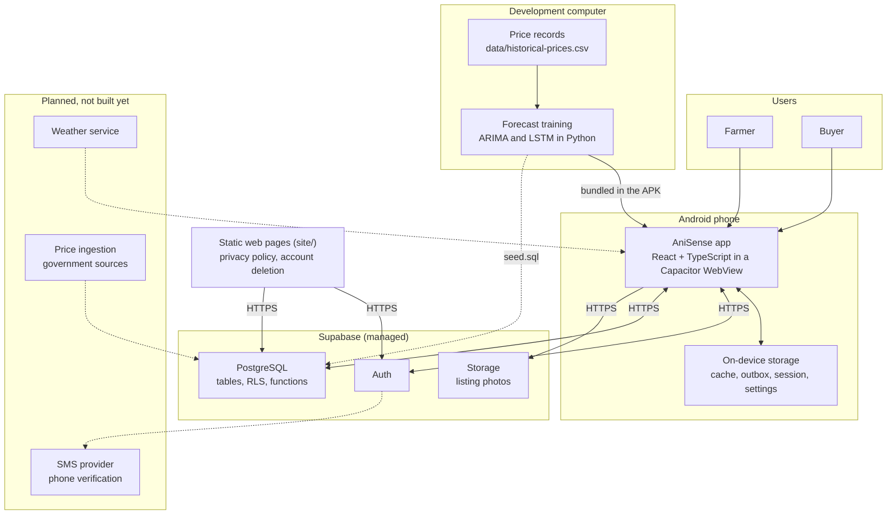
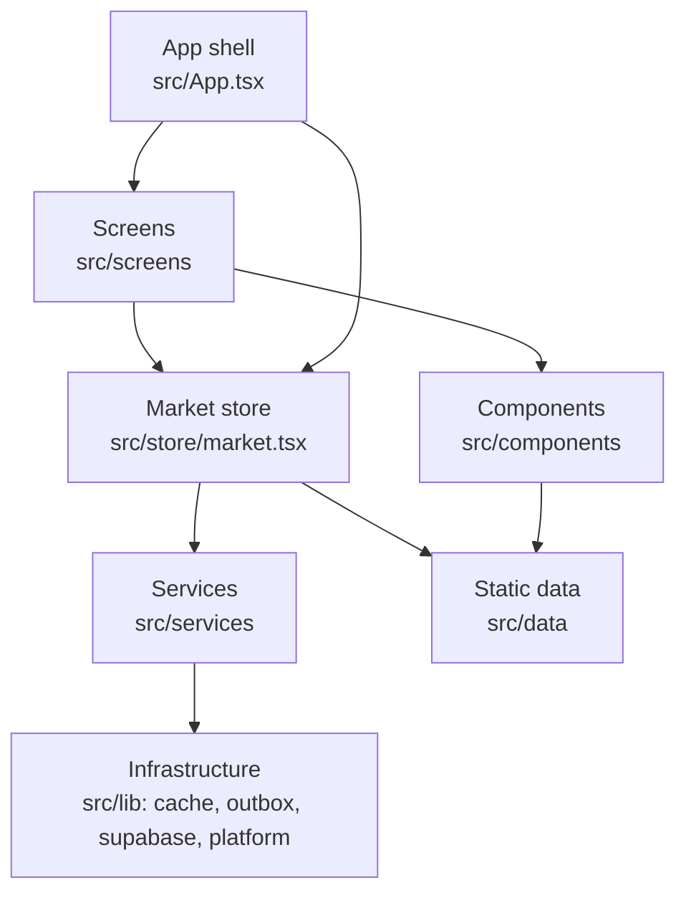
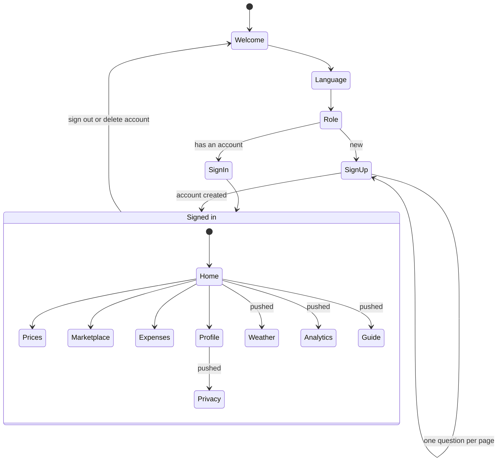
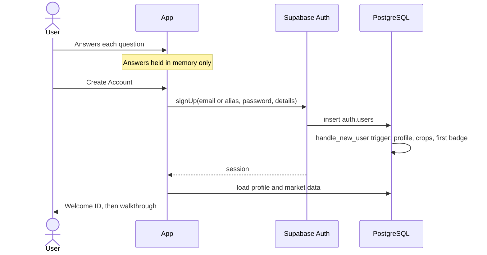
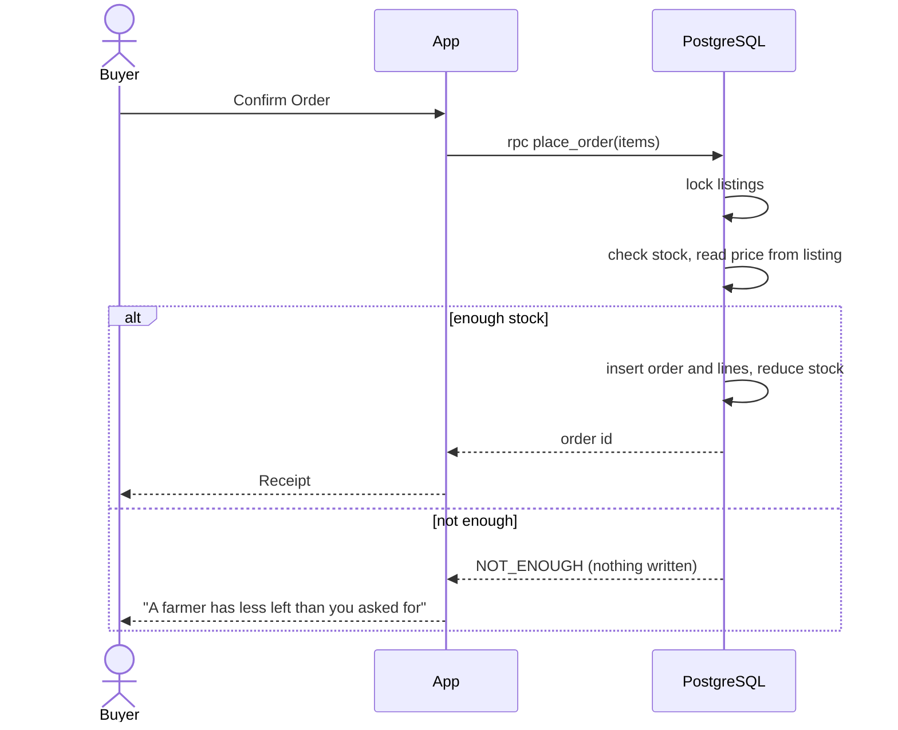
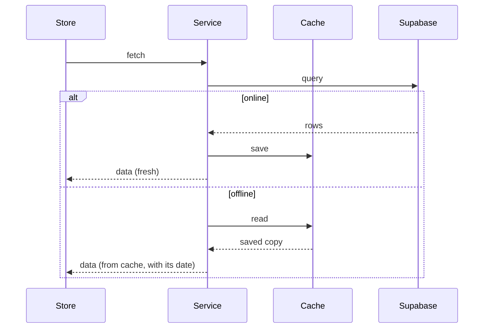
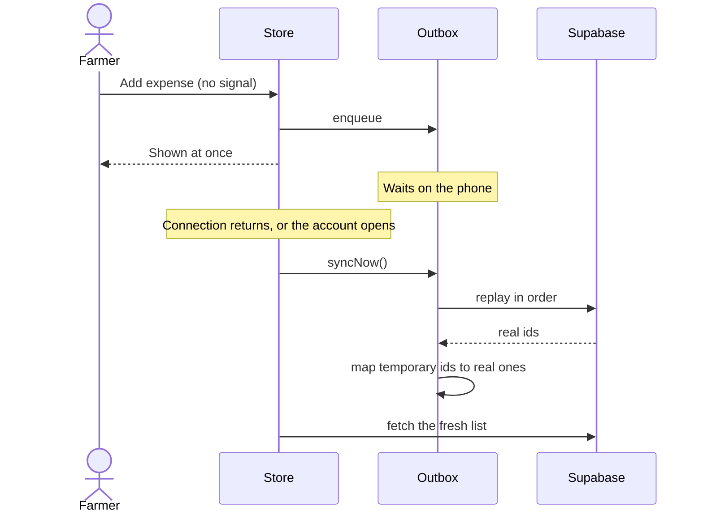
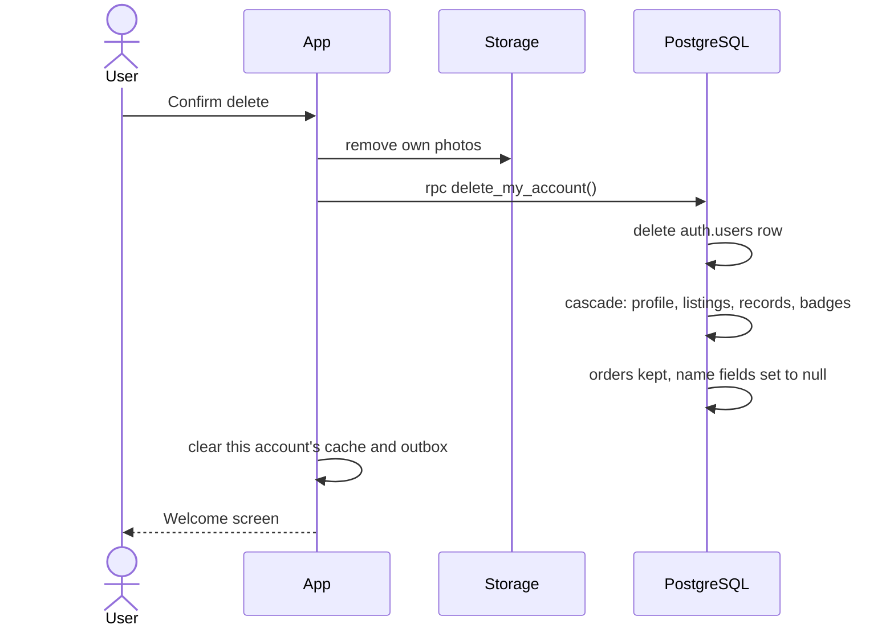
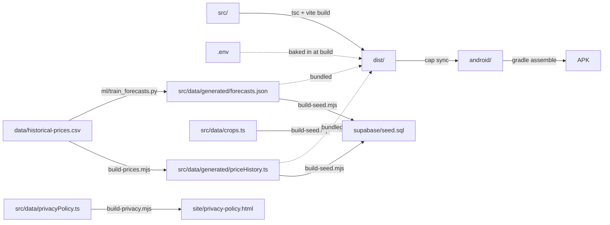

# AniSense architecture

This document describes how AniSense is built: its parts, how they depend on each other, how data moves, and the decisions behind that. For setup and build instructions see [README.md](../README.md) and [database-setup.md](database-setup.md); for the database tables see [supabase/README.md](../supabase/README.md).

## Contents

1. [System overview](#1-system-overview)
2. [Constraints that shaped the design](#2-constraints-that-shaped-the-design)
3. [Client architecture](#3-client-architecture)
4. [Backend architecture](#4-backend-architecture)
5. [Key flows](#5-key-flows)
6. [Offline design](#6-offline-design)
7. [Security](#7-security)
8. [Build and delivery](#8-build-and-delivery)
9. [Decision log](#9-decision-log)
10. [Known limitations and planned work](#10-known-limitations-and-planned-work)

## 1. System overview

AniSense is a single-codebase mobile app: a React and TypeScript web app packaged for Android with Capacitor, backed by Supabase.

There is no custom application server. The app talks to Supabase directly, and every rule that matters (who can read what, how an order is priced, how stock is reduced) is enforced inside the database.

The forecast models are not part of the running system. They are trained on a development computer from the price records, and only their results travel: inside the APK, and into the database through the seed file.

## 2. Constraints that shaped the design

| Constraint | Consequence |
|---|---|
| Users are 50 to 70 years old, on budget Android phones | One codebase tuned for one platform; large type and targets; no gestures required; English and Tagalog. |
| Signal in the fields is unreliable | A farmer's own records work offline and sync later; prices, their history and the forecasts ship inside the app. |
| The price records are monthly | Every price move is worded "from the month before", never "today"; forecasts look three months ahead. |
| Forecasts can be badly wrong for volatile crops | Each forecast carries its tested error, and above a set error the app gives no sell-or-wait advice. |
| A small team and no operations budget | A managed backend with no server to run; business rules in SQL, next to the data. |
| The app must be demonstrable before the backend exists | A demo mode that runs entirely on bundled sample data. |
| The key shipped in the app is public | Security cannot depend on the client; Row Level Security on every table. |

## 3. Client architecture

### 3.1 Layers

| Layer | Location | Responsibility |
|---|---|---|
| App shell | `src/App.tsx` | Authentication state, which screen is showing, session restore, the walkthrough and achievement overlays. Injects the stylesheets. |
| Screens | `src/screens/` | One file per screen. Compose components and read from the store. |
| Components | `src/components/` | Reusable UI, grouped by feature (`home`, `analytics`, `marketplace`, `prices`, `privacy`, `profile`, `tour`), plus shared building blocks (`ui`, `layout`, `icons`, `brand`, `states`, `charts`). |
| Store | `src/store/` | `market.tsx`, the single data layer, and `viewer.ts`, the context that says who is looking. The market store holds listings, sellers, purchases, expenses, farm records, a farmer's incoming orders, prices and badges, and exposes actions to change them. |
| Services | `src/services/` | One file per domain (`auth`, `listings`, `transactions`, `expenses`, `farmRecords`, `catalog`, `sync`). The only code that calls Supabase. |
| Infrastructure and helpers | `src/lib/` | Supabase client, cache, outbox, platform wrappers (haptics, status bar, keyboard), and small domain helpers (alerts, achievements, plantings, sales). |
| Static data | `src/data/` | The crop catalog, Philippine locations, the privacy policy and terms of service, and the readers for the price records and forecasts. Two subfolders: `generated/`, written by scripts and never edited by hand, and `demo/`, the sample data for demo mode. |

**Dependency rule:** screens and components never import the Supabase client. They read and write through the store, which decides whether to call a service or use sample data. This keeps the live and demo modes from leaking into the UI.

### 3.2 Two modes

The store picks a mode from one condition: Supabase is configured **and** a real account is signed in.

| | Live | Demo |
|---|---|---|
| When | `.env` is present and an account is signed in | No `.env`, or the demo sign-in |
| Data source | Supabase | Bundled sample data in `src/data/` |
| Writes | Database (queued when offline, where supported) | Memory, with farm records kept on the phone |
| Purpose | Real use | Demonstrations and development without a backend |

### 3.3 State

State lives in React, with no external state library:

- **`App.tsx`** owns authentication and navigation state.
- **`MarketContext`** provides the market store to every screen.
- **`ViewerContext`** provides who is looking (role and location) and what is waiting for them (price alerts, plantings, incoming orders) to the header, which every screen shares.
- **`LanguageProvider`** provides the language and the translation functions.

### 3.4 Navigation

Navigation is state, not URLs. There is no router, because the app has no addresses to share and runs inside a WebView.

- Before sign-in, an `authScreen` value steps through welcome, language, role and the account form.
- After sign-in, an `active` value selects the screen. The five tab screens switch in place; the others are pushed and return on Back.
- Android's hardware Back is handled by a small stack (`useHardwareBack`): the topmost open sheet closes first, then pushed screens, then the app.

### 3.5 Styling

Styles are plain CSS held in TypeScript strings (`src/styles/*.ts`) and injected with `<style>` tags. A shared token file defines color, type, radius, motion and spacing. This avoids a CSS toolchain and keeps each stylesheet next to the rationale in its comments.

### 3.6 Localization

Every interface string is an entry in `src/i18n.tsx` with English and Tagalog text. Components call `t(key)` for strings and `tn(name)` for crop names. A few market terms stay in English by design. The privacy policy (`src/data/privacyPolicy.ts`) and the terms of service (`src/data/termsOfService.ts`) are English only and are never translated.

### 3.7 Prices and forecasts

| File | Role |
|---|---|
| `src/data/generated/priceHistory.ts` | The monthly price records, generated from `data/historical-prices.csv`. Bundled. |
| `src/data/priceRecords.ts` | Reads the records: a variety's history, its newest price, and the change from the month before. Lays the database's records over the bundled ones when they arrive. |
| `src/data/generated/forecasts.json` | The finished forecasts and each model's tested error, written by `ml/train_forecasts.py`. Bundled. |
| `src/data/forecast.ts` | Reads the forecasts. Hides a forecast month once a real record exists for it, and marks a forecast as unreliable when its tested error is above `RELIABLE_MAPE` (20%). |

- The catalog in `src/data/crops.ts` takes the price of the study's five varieties from the records as it loads. The other 19 varieties have no records, and their prices are sample values.
- The LSTM forecast drives the price charts; the ARIMA forecast drives the sell-or-wait advice and the Home card.
- The phone runs no model and holds no machine-learning library.

### 3.8 Alerts

The bell in the header counts alerts derived from data the app already holds (`src/lib/alerts.ts`): a farmer's incoming orders, plantings that are due, price targets that were met, rain, and the sharpest price moves. Buyers get a different set.

An incoming order is the only alert with actions: it shows the buyer's name and number, a Call button that opens the dialer, and a Confirm button. **It is a mockup**: two sample orders in demo mode (`src/data/demo/orders.ts`), none on a real account, and not connected to checkout.

## 4. Backend architecture

Supabase provides four things:

| Service | Use |
|---|---|
| Auth | Accounts and sessions. A mobile-number account is stored as an email alias until SMS verification is added. |
| PostgreSQL | 16 tables in five sections: catalog, accounts, market, farm records, rewards. |
| Functions (PL/pgSQL) | Operations that must be atomic or must not trust the client. |
| Storage | One public bucket for listing photos, written only by the owner. |

Server-side functions:

| Function | Why it runs on the server |
|---|---|
| `handle_new_user` | Creates the profile and crop list when an account is created. |
| `place_order` | Locks the listings, checks stock, takes the price from the listing, writes the order and reduces stock, all in one transaction. |
| `replace_my_sales`, `replace_my_plantings`, `replace_my_price_alerts`, `replace_my_harvest_plans` | Replace one of a farmer's lists in a single step, which makes offline sync idempotent. |
| `set_my_crops` | Replaces the crops a farmer grows. |
| `delete_my_account` | Deletes the caller's own account; takes no argument, so it cannot target anyone else. |
| Award triggers | Grant badges when a profile, first listing or first sale appears. |

The catalog section holds the price records (`crop_prices`) and the forecasts (`crop_forecasts`). Both are written by the seed file, never by the app, and are readable by any signed-in account.

The full table and relationship reference is in [supabase/README.md](../supabase/README.md).

## 5. Key flows

### 5.1 Creating an account

Sign-up collects answers across several pages but creates the account once, at the end. An account created on the first page would be left without a town or crops if the user stopped halfway.

### 5.2 Checkout

The client sends only listing ids and quantities. Price and seller are read on the server, so a modified client cannot change what it pays.

### 5.3 Reading data

Every read goes through `cachedFetch`: a successful response is saved on the phone, and a failed one falls back to the saved copy.

### 5.4 Writing while offline

### 5.5 Deleting an account

The same function is called by the web page in `site/`, for someone who no longer has the app.

### 5.6 A new month of prices

1. A row is added to `data/historical-prices.csv` (or a newer PDF is imported with `ml/import_pdf.py`).
2. `npm run prices` rebuilds the bundled history.
3. `npm run forecasts` trains and tests both models again and rewrites the forecasts and the report.
4. `npm run seed` rewrites the database's copy, which is then run in the SQL Editor.
5. A new APK carries the update to phones. A phone signed in to a real account also picks it up from the database the next time it is online.

There is no upload inside the app. The steps are in [ml/README.md](../ml/README.md).

## 6. Offline design

| Mechanism | File | Role |
|---|---|---|
| Cache | `src/lib/cache.ts` | Saves each successful read; serves it when the network fails. |
| Outbox | `src/lib/outbox.ts` | Queues writes made offline, in order. |
| Sync | `src/services/sync.ts` | Replays the outbox when an account opens or the connection returns. |

Design points:

- **Bundled data.** The price records and the forecasts are part of the APK, so prices, their charts and the forecasts show on a phone that has never been online.
- **Storage.** Both use Capacitor Preferences, which is native storage on Android. WebView `localStorage` can be cleared by the system under storage pressure.
- **Scoped per account.** Every cache key and queued operation carries the account id, so two accounts on one phone never see or send each other's data.
- **Idempotent sync.** Farm-record lists are saved by replacing the whole list on the server, so replaying an operation twice is harmless.
- **Deliberately online-only.** Posting a listing and checkout need the server because they involve other people's stock. The app says so plainly instead of queuing them.

## 7. Security

- **Row Level Security on every table.** Access is decided by the database from the signed-in user's id.
- **Least exposure.** Farmer profiles are visible to signed-in users, because buyers must find them. A buyer's details are visible only to farmers that buyer has ordered from. Farm records are visible only to their owner.
- **Column-level grants.** Users can update their own name, phone, location and bio, but not their rating or sales count.
- **Server-side operations.** Orders can be created only through `place_order`.
- **No secrets in the client.** The app and the web pages use the publishable key only. `npm run check:db` refuses to run if it finds a secret key in `.env`.
- **Passwords** are handled by Supabase Auth and stored hashed.
- **Transport** is HTTPS throughout.

## 8. Build and delivery

- Environment values are compiled into the bundle, so a build made without `.env` is a demo build.
- Generators keep derived files in step with their source: the database seed is generated from the crop catalog, the price records and the forecasts, and the web privacy policy from the text the app shows.
- Prices follow one path: `data/historical-prices.csv` holds the monthly records. From it come the history the app bundles (so prices show offline), the ARIMA and LSTM forecasts (trained locally in Python, never on the phone), and the database's copy. Signed in, the app lays the database's records and forecasts over the bundled ones, so a new month reaches phones without a new APK.
- `site/` is a static site (privacy policy and account deletion) that any static host can serve. `.github/workflows/pages.yml` publishes it to GitHub Pages.
- `.github/workflows/ci.yml` type-checks and builds the app on every push and pull request, without `.env`, so it builds the demo.

## 9. Decision log

| Decision | Alternatives considered | Reason |
|---|---|---|
| Supabase as the backend | Firebase, a custom server | Relational data (orders, stock, records) fits SQL; Row Level Security and SQL functions keep rules next to the data; standard PostgreSQL avoids lock-in. |
| Capacitor around a web app | Native Android, React Native, Flutter | One codebase and the fastest iteration; the app needs little native capability. |
| No router | React Router | No shareable URLs inside a WebView; two small pieces of state are simpler. |
| No state library | Redux, Zustand | One store and two small contexts cover the app. |
| CSS in TypeScript strings | Tailwind, CSS modules | No extra toolchain; design tokens and rationale live with the styles. |
| Business rules in SQL functions | Rules in the client or in server functions elsewhere | The client is untrusted; a single transaction is needed for checkout. |
| Mobile-number accounts as an email alias | Supabase phone auth from day one | Phone auth needs a paid SMS provider; the alias can be migrated later without users losing their login. |
| Create the account at the last sign-up step | Create on the first page | Avoids half-complete accounts. |
| Keep orders when an account is deleted, with the name removed | Delete orders with the account | An order is also the other party's record of a sale. |
| One source for the privacy policy | Separate app and web copies | The two can never disagree. |
| Privacy policy and terms of service in English only | English and Tagalog | The owner's decision: one text, so there is never a question of which version is binding. |
| Agree to the terms on the first sign-up page, with a checkbox | A line under the last page's button; no explicit step | Consent is given before any personal detail is typed, and a ticked box is a clear choice. The agreement is not yet stored with the account. |
| Train the models on a computer and ship the forecasts as data | Run the model on the phone (TensorFlow.js); train in the cloud | The forecast is the same for every user, so it is worked out once. The app stays small, needs no machine-learning library, and works offline. Training takes about a minute on a laptop. |
| Show each model's tested error, and give no advice above 20% | Show every forecast the same way | Onion and calamansi forecasts were 28 to 52% off in testing; a farmer should not hold a harvest on them. |
| Word prices by the month | Keep "today" and "yesterday" | The records are monthly; daily wording would be false. |

## 10. Known limitations and planned work

| Area | Current state | Plan |
|---|---|---|
| Crop prices | Monthly records for five varieties, added to a CSV by hand; sample values for the other 19 | Records for the remaining varieties; ingestion from government sources on a schedule. |
| Price forecasts | ARIMA and LSTM trained on the five varieties' records. The ARIMA search picks the differencing order by AIC, which is not the right tool for it; the LSTM's settings were not tuned; neither model can foresee a price shock. | Choose the differencing order with a stationarity test; tune the LSTM with a small grid scored inside the training months; test a seasonal ARIMA; consider extra inputs (weather, costs) as later work. |
| Order alerts | A mockup with sample orders, in demo mode only | Read a farmer's incoming orders and the buyer's contact from the database, save the confirmation, and send a push notification. |
| Weather | Sample values in `src/data/demo/weather.ts` | Connect a forecast service. PAGASA's TenDay API needs a token that PAGASA approves on request, and it gives daily forecasts, not current conditions. |
| Phone and Gmail verification | A sign-up code step exists, but as a mockup: `src/services/verification.ts` makes the code on the phone and the screen shows it. | Replace its two functions with calls to a server function that texts (Semaphore) or emails the code and checks it there. The form does not change. |
| Password reset | Not implemented | Email reset for Gmail accounts; SMS code for mobile-number accounts. |
| Automated tests | None in the repository | Add unit tests for the services and the store, and database tests for the SQL functions. |
| Continuous integration | Type-check and build on every push (`.github/workflows/ci.yml`) | Run the automated tests there once they exist. |
| iOS | Not targeted | Capacitor supports it if needed later. |
