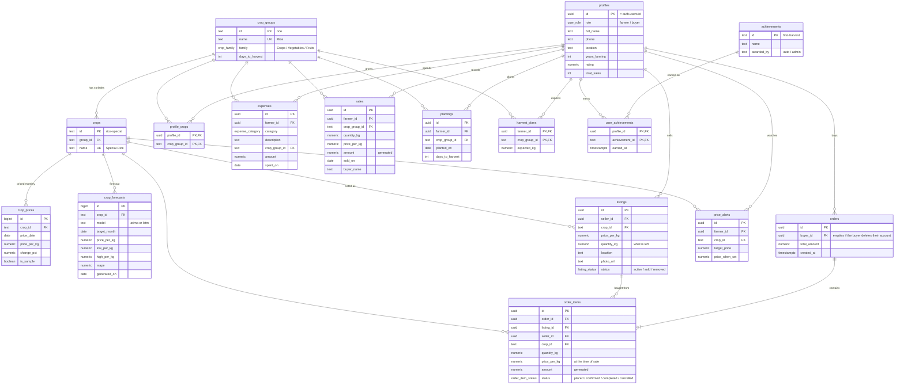

# AniSense database

PostgreSQL on Supabase, in five sections. Every feature of the app keeps its data here once a project is connected (see `SETUP_DATABASE.md`).

| File | What it is | When to run it |
|---|---|---|
| `schema.sql` | Every table, security rule and function | First. Safe to run again. |
| `seed.sql` | The crop catalog, the price records (2021 to 2026), the forecasts, the badges | Second. Safe to run again. Generated by `node scripts/build-seed.mjs` from `src/data/crops.ts`, `data/historical-prices.csv` and the trained forecasts. |
| `reset.sql` | ⚠ Deletes everything | Development only, to start over. |

## How the tables connect



## The tables

**1. Catalog.** What can be grown, sold and priced. Reference data, changed by the admin only.
- `crop_groups`: the 10 crop types (Rice, Corn, Onions…), their family and typical days to harvest.
- `crops`: the 24 varieties (Special Rice, Red Onion, Carabao Mango…).
- `crop_prices`: the retail price records, one per variety per date. The study's five varieties have one record a month from 2021, dated the 1st; `change_pct` is the move from the record before. A variety with no records holds one placeholder marked `is_sample`. The view `crop_prices_latest` gives the newest price of each variety.
- `crop_forecasts`: what ARIMA and LSTM expect for the months ahead, per variety, with the likely range and each model's tested error (`mape`). Written by `seed.sql`, never by the app.

**2. Accounts.**
- `profiles`: one per person, created automatically at sign-up.
- `profile_crops`: which crop types each farmer grows.

**3. Market.**
- `listings`: harvests for sale. `quantity_kg` goes down as orders come in.
- `orders`: one per checkout.
- `order_items`: one line per listing bought. Price, crop and seller are copied at the moment of sale, so history never changes.

**4. Farm records.** Private to each farmer.
- `expenses`: costs by category and crop.
- `sales`: sales made outside the app. Market sales are the farmer's `order_items`.
- `plantings`: what is in the ground, for the harvest countdown.
- `price_alerts`: target prices to watch.
- `harvest_plans`: expected kilos per crop, for estimated profit.

**5. Rewards.**
- `achievements`: the 6 badges.
- `user_achievements`: who earned which, and when.

## Functions

| Function | Does |
|---|---|
| `handle_new_user()` | Trigger: builds the profile and crop list from the sign-up form |
| `place_order(items)` | Checkout, all or nothing: checks stock, lowers it, writes the order at the listing's price |
| `set_my_crops(names)` | Replaces the farmer's crop list |
| `replace_my_sales / plantings / price_alerts / harvest_plans` | Saves one of the farmer's lists in one step (used by the app, also after being offline) |
| `award…` triggers | Awards Newbie on sign-up, First harvest on a first listing, First sale on a first sale |
| `delete_my_account()` | Deletes the caller's own account and everything that is theirs alone. Orders stay in the other party's history, with the name removed |
| `catalog_status()` | Counts only, for `npm run check:db` |

## Security

Row Level Security is on for every table; the database enforces it, not the app.
- Nobody signed out can read anything.
- Farmers manage only their own listings and records.
- A buyer's phone number is visible only to farmers they have ordered from.
- Orders can only be made through `place_order()`.
- Nobody can edit their own rating or sales count.
- Farmers can move their own order lines to confirmed or completed, and change nothing else about them.
- Anyone can delete their own account, and only their own, through `delete_my_account()`.

## Everyday admin

**Add a new month's prices.** The records live in `data/historical-prices.csv`, one row per month. Add the row, then rebuild what is made from it:
```
2026-10,57.80,47.50,350.00,95.00,60.00        ← the new row in the CSV

npm run prices        the app's bundled history
npm run forecasts     trains ARIMA and LSTM again (see ml/README.md)
npm run seed          writes supabase/seed.sql
```
Then run `seed.sql` in the SQL Editor. Phones signed in to a real account pick up the new month and forecasts the next time they are online; build a new APK as well so first-time and offline users get it too.

To correct one price quickly, without the steps above (dated the 1st of its month; `change_pct` is the move from the month before, in percent):
```sql
insert into crop_prices (crop_id, price_date, price_per_kg, change_pct) values
  ('rice-special', '2026-10-01', 57.80, 1.0)
on conflict (crop_id, price_date) do update set price_per_kg = excluded.price_per_kg, change_pct = excluded.change_pct;
```
The forecasts are not retrained by this; run the steps above when you can.

**Name a Farmer of the Month or Year.** Copy the farmer's id from Table Editor → `profiles`.
```sql
insert into user_achievements (profile_id, achievement_id)
values ('<farmer id>', 'farmer-of-the-month');
```
